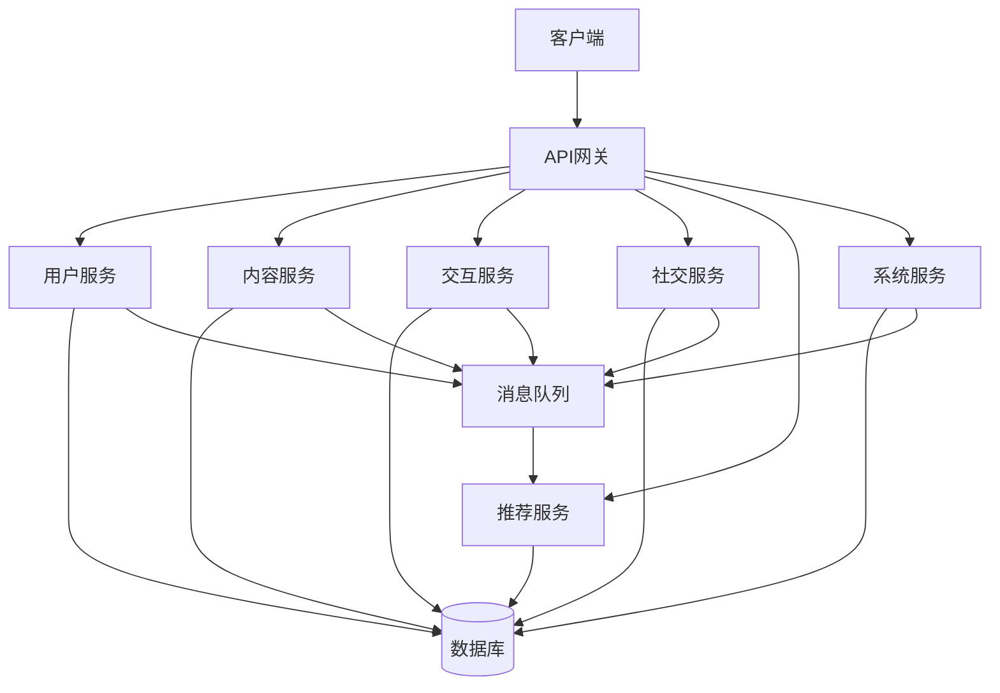

# Quadra 项目 Code Wiki

## 1. 项目概览

Quadra 是一个基于微服务架构的多模块项目，包含用户、内容、交互、社交、推荐和系统管理等核心功能。项目采用了现代的技术栈和架构设计，支持Web前端和微信小程序等多种客户端。

### 1.1 主要功能

- **用户管理**：用户注册、登录、个人信息管理
- **内容管理**：内容发布、管理、查询
- **社交功能**：用户匹配、关注、社交互动
- **推荐系统**：基于用户行为的内容和用户推荐
- **系统管理**：后台管理、日志监控、系统配置
- **交互功能**：用户之间的评论、点赞等交互

### 1.2 技术栈

| 分类 | 技术 | 版本 | 用途 |
| :--- | :--- | :--- | :--- |
| 后端框架 | Spring Boot | - | 微服务基础框架 |
| 微服务 | Spring Cloud | - | 微服务治理 |
| 服务发现 | Nacos | - | 服务注册与发现 |
| 消息队列 | RocketMQ | - | 异步消息处理 |
| 数据库访问 | MyBatis | - | ORM框架 |
| API网关 | Spring Cloud Gateway | - | 请求路由与API管理 |
| 前端框架 | React | 19.2.4 | Web前端 |
| 前端UI | Ant Design | 6.3.5 | UI组件库 |
| 构建工具 | Vite | 8.0.1 | 前端构建 |
| 小程序 | 微信小程序 | - | 移动应用 |
| 开发语言 | Java, TypeScript | - | 后端和前端开发 |

## 2. 项目架构

Quadra 项目采用微服务架构，由多个独立的服务模块组成，通过API网关进行统一访问。每个服务模块都采用六边形架构（端口和适配器模式），确保业务逻辑与外部依赖解耦。

### 2.1 整体架构



### 2.2 模块架构

每个服务模块都采用六边形架构，包含以下层次：

1. **适配器层（Adapter）**：
   - **输入适配器（Adapter-In）**：处理HTTP请求和消息队列
   - **输出适配器（Adapter-Out）**：处理数据库访问和外部服务调用

2. **应用层（Application）**：处理业务逻辑，协调领域对象

3. **领域层（Domain）**：定义核心业务模型和业务规则

4. **基础设施层（Infrastructure）**：提供配置和启动功能

## 3. 核心模块

### 3.1 网关模块（quadra-gateway-module）

**职责**：负责请求路由、API管理、Swagger UI集成

**主要配置**：
- 服务端口：18080
- 服务名称：quadra-gateway
- 路由配置：将请求路由到各个微服务
- Swagger UI：集成所有微服务的API文档

**关键类**：
- `QuadraGatewayApplication`：网关服务启动类

**配置文件**：
- [application.properties](file:///Users/wuyunbin/workspace/quadra/quadra-gateway-module/quadra-gateway-infrastructure/src/main/resources/application.properties)

### 3.2 用户模块（quadra-user-module）

**职责**：处理用户注册、登录、个人信息管理

**主要功能**：
- 用户注册和登录
- 个人信息管理
- 用户认证和授权

**关键类**：
- `QuadraUserApplication`：用户服务启动类

**配置文件**：
- [application.properties](file:///Users/wuyunbin/workspace/quadra/quadra-user-module/quadra-user-infrastructure/src/main/resources/application.properties)

### 3.3 内容模块（quadra-content-module）

**职责**：处理内容发布、管理、查询

**主要功能**：
- 内容发布和管理
- 内容查询和检索
- 内容审核

**关键类**：
- `QuadraContentApplication`：内容服务启动类

**配置文件**：
- [application.properties](file:///Users/wuyunbin/workspace/quadra/quadra-content-module/quadra-content-infrastructure/src/main/resources/application.properties)

### 3.4 交互模块（quadra-interaction-module）

**职责**：处理用户之间的交互

**主要功能**：
- 评论管理
- 点赞管理
- 互动记录

**关键类**：
- `QuadraInteractionApplication`：交互服务启动类

**配置文件**：
- [application.properties](file:///Users/wuyunbin/workspace/quadra/quadra-interaction-module/quadra-interaction-infrastructure/src/main/resources/application.properties)

### 3.5 社交模块（quadra-social-module）

**职责**：处理社交关系、匹配等

**主要功能**：
- 用户匹配
- 关注管理
- 社交关系维护

**关键类**：
- `QuadraSocialApplication`：社交服务启动类

**配置文件**：
- [application.properties](file:///Users/wuyunbin/workspace/quadra/quadra-social-module/quadra-social-infrastructure/src/main/resources/application.properties)

### 3.6 推荐模块（quadra-recommend-module）

**职责**：处理内容和用户推荐

**主要功能**：
- 基于用户行为的内容推荐
- 用户推荐
- 推荐算法管理

**关键类**：
- `QuadraRecommendApplication`：推荐服务启动类

**配置文件**：
- [application.properties](file:///Users/wuyunbin/workspace/quadra/quadra-recommend-module/quadra-recommend-infrastructure/src/main/resources/application.properties)

### 3.7 系统模块（quadra-system-module）

**职责**：处理系统管理、日志、监控等

**主要功能**：
- 后台管理
- 日志管理
- 系统监控
- 消息推送

**关键类**：
- `QuadraSystemApplication`：系统服务启动类

**配置文件**：
- [application.properties](file:///Users/wuyunbin/workspace/quadra/quadra-system-module/quadra-system-infrastructure/src/main/resources/application.properties)

### 3.8 前端项目（quadra-vite）

**职责**：提供Web界面

**主要功能**：
- 用户界面
- 管理后台
- 数据可视化

**技术栈**：
- React 19.2.4
- TypeScript
- Ant Design 6.3.5
- Vite 8.0.1

**关键文件**：
- [package.json](file:///Users/wuyunbin/workspace/quadra/quadra-vite/package.json)
- [src/App.tsx](file:///Users/wuyunbin/workspace/quadra/quadra-vite/src/App.tsx)
- [src/router/index.tsx](file:///Users/wuyunbin/workspace/quadra/quadra-vite/src/router/index.tsx)

### 3.9 小程序项目（quadra-mp）

**职责**：提供移动应用界面

**主要功能**：
- 用户登录和注册
- 内容浏览
- 社交互动

**技术栈**：
- TypeScript
- 微信小程序

**关键文件**：
- [package.json](file:///Users/wuyunbin/workspace/quadra/quadra-mp/package.json)
- [miniprogram/app.ts](file:///Users/wuyunbin/workspace/quadra/quadra-mp/miniprogram/app.ts)

## 4. 关键类与函数

### 4.1 网关模块

#### QuadraGatewayApplication

**功能**：网关服务启动类

**路径**：[quadra-gateway-module/quadra-gateway-infrastructure/src/main/java/com/quadra/gateway/infrastructure/QuadraGatewayApplication.java](file:///Users/wuyunbin/workspace/quadra/quadra-gateway-module/quadra-gateway-infrastructure/src/main/java/com/quadra/gateway/infrastructure/QuadraGatewayApplication.java)

**主要方法**：
- `main(String[] args)`：启动网关服务

### 4.2 用户模块

#### QuadraUserApplication

**功能**：用户服务启动类

**路径**：[quadra-user-module/quadra-user-infrastructure/src/main/java/com/quadra/user/infrastructure/QuadraUserApplication.java](file:///Users/wuyunbin/workspace/quadra/quadra-user-module/quadra-user-infrastructure/src/main/java/com/quadra/user/infrastructure/QuadraUserApplication.java)

**主要方法**：
- `main(String[] args)`：启动用户服务

### 4.3 内容模块

#### QuadraContentApplication

**功能**：内容服务启动类

**路径**：[quadra-content-module/quadra-content-infrastructure/src/main/java/com/quadra/content/infrastructure/QuadraContentApplication.java](file:///Users/wuyunbin/workspace/quadra/quadra-content-module/quadra-content-infrastructure/src/main/java/com/quadra/content/infrastructure/QuadraContentApplication.java)

**主要方法**：
- `main(String[] args)`：启动内容服务

### 4.4 交互模块

#### QuadraInteractionApplication

**功能**：交互服务启动类

**路径**：[quadra-interaction-module/quadra-interaction-infrastructure/src/main/java/com/quadra/interaction/infrastructure/QuadraInteractionApplication.java](file:///Users/wuyunbin/workspace/quadra/quadra-interaction-module/quadra-interaction-infrastructure/src/main/java/com/quadra/interaction/infrastructure/QuadraInteractionApplication.java)

**主要方法**：
- `main(String[] args)`：启动交互服务

### 4.5 社交模块

#### QuadraSocialApplication

**功能**：社交服务启动类

**路径**：[quadra-social-module/quadra-social-infrastructure/src/main/java/com/quadra/social/infrastructure/QuadraSocialApplication.java](file:///Users/wuyunbin/workspace/quadra/quadra-social-module/quadra-social-infrastructure/src/main/java/com/quadra/social/infrastructure/QuadraSocialApplication.java)

**主要方法**：
- `main(String[] args)`：启动社交服务

### 4.6 推荐模块

#### QuadraRecommendApplication

**功能**：推荐服务启动类

**路径**：[quadra-recommend-module/quadra-recommend-infrastructure/src/main/java/com/quadra/recommend/infrastructure/QuadraRecommendApplication.java](file:///Users/wuyunbin/workspace/quadra/quadra-recommend-module/quadra-recommend-infrastructure/src/main/java/com/quadra/recommend/infrastructure/QuadraRecommendApplication.java)

**主要方法**：
- `main(String[] args)`：启动推荐服务

### 4.7 系统模块

#### QuadraSystemApplication

**功能**：系统服务启动类

**路径**：[quadra-system-module/quadra-system-infrastructure/src/main/java/com/quadra/system/infrastructure/QuadraSystemApplication.java](file:///Users/wuyunbin/workspace/quadra/quadra-system-module/quadra-system-infrastructure/src/main/java/com/quadra/system/infrastructure/QuadraSystemApplication.java)

**主要方法**：
- `main(String[] args)`：启动系统服务

## 5. 依赖关系

### 5.1 服务间依赖

| 服务 | 依赖服务 | 依赖类型 |
| :--- | :--- | :--- |
| quadra-gateway | 所有微服务 | 路由依赖 |
| quadra-system | 其他服务 | 监控和管理 |
| quadra-recommend | 用户、内容、交互、社交 | 数据依赖 |

### 5.2 技术依赖

| 依赖 | 用途 | 服务 |
| :--- | :--- | :--- |
| Spring Boot | 微服务基础框架 | 所有服务 |
| Spring Cloud | 微服务治理 | 所有服务 |
| Nacos | 服务注册与发现 | 所有服务 |
| RocketMQ | 消息队列 | 所有服务 |
| MyBatis | ORM框架 | 所有服务 |
| React | 前端框架 | quadra-vite |
| Ant Design | UI组件库 | quadra-vite |
| Vite | 前端构建 | quadra-vite |

## 6. 项目运行

### 6.1 后端服务运行

1. **启动Nacos服务**：
   - 下载并启动Nacos服务，默认端口8848

2. **启动RocketMQ服务**：
   - 下载并启动RocketMQ服务，默认端口9876

3. **启动微服务**：
   - 依次启动各个微服务模块：
     - quadra-user-module
     - quadra-content-module
     - quadra-interaction-module
     - quadra-social-module
     - quadra-recommend-module
     - quadra-system-module
     - quadra-gateway-module

### 6.2 前端项目运行

1. **安装依赖**：
   ```bash
   cd quadra-vite
   npm install
   ```

2. **启动开发服务器**：
   ```bash
   npm run dev
   ```

3. **构建生产版本**：
   ```bash
   npm run build
   ```

### 6.3 小程序项目运行

1. **安装依赖**：
   ```bash
   cd quadra-mp
   npm install
   ```

2. **使用微信开发者工具**：
   - 打开微信开发者工具
   - 导入quadra-mp目录
   - 编译并运行

## 7. API文档

项目使用Swagger UI提供API文档，可通过以下地址访问：

- **API文档地址**：http://localhost:18080/swagger-ui.html

## 8. 数据库

项目使用MySQL数据库，数据库脚本位于[sql目录](file:///Users/wuyunbin/workspace/quadra/sql)：

- quadra_user.sql：用户模块数据库脚本
- quadra_content.sql：内容模块数据库脚本
- quadra_interaction.sql：交互模块数据库脚本
- quadra_social.sql：社交模块数据库脚本
- quadra_recommend.sql：推荐模块数据库脚本
- quadra_system.sql：系统模块数据库脚本

## 9. 部署

### 9.1 后端服务部署

1. **构建服务**：
   ```bash
   mvn clean package
   ```

2. **部署到服务器**：
   - 将构建好的jar包上传到服务器
   - 使用systemd或其他方式管理服务

### 9.2 前端项目部署

1. **构建项目**：
   ```bash
   npm run build
   ```

2. **部署到服务器**：
   - 将构建好的dist目录上传到服务器
   - 使用Nginx或其他Web服务器部署

### 9.3 小程序部署

1. **提交审核**：
   - 在微信开发者工具中提交代码审核

2. **发布上线**：
   - 审核通过后发布上线

## 10. 监控与维护

### 10.1 系统监控

- **Actuator端点**：http://localhost:18080/actuator
- **网关监控**：http://localhost:18080/actuator/gateway

### 10.2 日志管理

- 系统日志：各服务的日志文件
- 操作日志：系统模块记录的操作日志
- API日志：API请求日志

### 10.3 常见问题

| 问题 | 可能原因 | 解决方案 |
| :--- | :--- | :--- |
| 服务无法启动 | 端口被占用 | 检查端口占用情况，修改配置文件 |
| 服务注册失败 | Nacos服务未启动 | 确保Nacos服务正常运行 |
| 消息发送失败 | RocketMQ服务未启动 | 确保RocketMQ服务正常运行 |
| 数据库连接失败 | 数据库服务未启动或配置错误 | 检查数据库服务和配置 |

## 11. 开发指南

### 11.1 代码规范

- 后端：遵循Spring Boot代码规范
- 前端：遵循React和TypeScript代码规范

### 11.2 开发流程

1. **需求分析**：分析需求，确定功能点
2. **设计**：设计API和数据模型
3. **编码**：实现功能代码
4. **测试**：编写和运行测试
5. **提交**：提交代码到版本控制系统
6. **部署**：部署到测试环境
7. **验证**：验证功能是否正常
8. **发布**：发布到生产环境

### 11.3 常用命令

**后端**：
- 构建：`mvn clean package`
- 运行：`mvn spring-boot:run`
- 测试：`mvn test`

**前端**：
- 安装依赖：`npm install`
- 开发模式：`npm run dev`
- 构建：`npm run build`
- 代码检查：`npm run lint`

**小程序**：
- 安装依赖：`npm install`
- 编译：在微信开发者工具中编译

## 12. 总结

Quadra 项目是一个功能完整、架构清晰的微服务项目，采用了现代的技术栈和架构设计。项目包含多个独立的服务模块，通过API网关进行统一访问，支持Web前端和微信小程序等多种客户端。

项目的主要特点：

1. **微服务架构**：采用Spring Cloud微服务架构，服务之间通过RESTful API和消息队列进行通信
2. **六边形架构**：每个服务模块都采用六边形架构，确保业务逻辑与外部依赖解耦
3. **技术栈现代化**：使用Spring Boot、Spring Cloud、React、TypeScript等现代技术
4. **多客户端支持**：支持Web前端和微信小程序等多种客户端
5. **完整的功能**：包含用户、内容、交互、社交、推荐和系统管理等核心功能

Quadra 项目为开发者提供了一个完整的微服务架构示例，可作为学习和开发类似项目的参考。